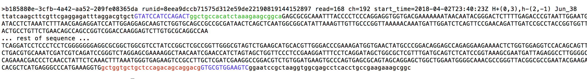

# minibar
Dual barcode and primer demultiplexing for MinION sequenced reads

Minibar is developed for and accompanies the paper:
\
<sub><b>Nanopore sequencing of long ribosomal DNA amplicons enables portable and simple biodiversity assessments with high phylogenetic resolution across broad taxonomic scale.</b> Henrik Krehenwinkel, Aaron Pomerantz, James B. Henderson, Susan R. Kennedy, Jun Ying Lim, Varun Swamy, Juan Diego Shoobridge, Nipam H. Patel, Rosemary G. Gillespie, Stefan Prost</sub>

Although, as you'll see below there are many possible options, minibar defaults are set so a typical run might look like:
```
./minibar.py -T -F Demultiplex.txt my_sequences.fastq
```

### Requirements
**minibar.py** is written in Python version 2.7 and is compatible with Python version 3. It imports the edlib library which
you can install using **pip install edlib** and, if you are interested, its source can be found at https://github.com/Martinsos/edlib. 

With the requirements of a typical Python installation, the minibar.py source and the edlib module installed, minibar has run on MacOS, Linux and Windows machines.

You can download the file using curl or wget from https://raw.githubusercontent.com/calacademy-research/minibar/master/minibar.py and use `chmod 775 minibar.py` to permit execution of the python script.

### Usage
Here are the complete set of options available to you.
  
    Usage: minibar.py barcode_file sequence_file [-pct <pct> | -e <int> -E <int>] [-l <int>]
                                                 [-F [-P <prefix>]] [-M 1|2|3]
                                                 [-S | -T | -C | -CC | -D]
                                                 [-cols <int_list>] [-info cols|fwd|rev|primer]
                                                 [-w] [-fh | -nh] [-n <num_seqs> | -n <first_seq>,<num_seqs>]

        Identify MinION sequence by dual barcode indexes and primers.
        The sequence file can be in Fasta or Fastq format, gzipped or plain text.
        Sample ID is placed at end of header comment with match hit info before it.
        (minibar.py version 0.21)

        Example: ./minibar.py -C -F Demultiplex.txt example.fq

        -h display this with all option's descriptions     -v displays version
        -p <pct> percentage match (.75)
        -e <int> barcode edit distance value, overrides -p (4)
        -E <int> primer edit distance value (11)
        -l <int> length to search for index and primer at start and end of sequence (80)

        -F create individual sample files for sequences with -S or -C output (default: False)
        -f write to stdout instead of creating files (default: True)
        -P <str> if -F, <str> is prefix for individual files, followed by sample ID. (default: sample_)

        -M 1|2|3 Method to identify sample types using the barcodes (default: 3)
                 1 requires approximate match of barcode and primer at sequence start, this
                   and barcodes matched at the other end are used to identify sample IDs
                 2 finds matched barcodes on both ends of sequence, identifies pairs that match a sample ID
                 3 uses Method 1 and if it does not succeed, uses Method 2

        -S outputs sequence record in fasta or fastq format of input (default output)
        -T trims barcode and primer from each end of the sequence, then outputs record
        -C similar to S but uses upper/lower case to show found barcode indexes and primers
        -CC also colors found barcode blue, primer green if found, primer red otherwise
        -D diagnostic output, instead of sequence displays edit distances of index and primer matches
        
        -cols <int_list> column position in barcode_file for: sample, fwd index, fwd primer, rev index, rev primer
                 (default: 1,2,3,4,5 if 5 cols; 1,3,4,5,6 if 6 cols; 1,3,4,6,7 if 7 cols; 1,3,5,8,10 if 10 or more cols)
                        
        -w  treat duplicates in barcode_file as warning, not error
        -fh first line of barcode file considered a header (default: auto detect header)
        -nh first line of barcode file is not a header (default: auto detect header)
        -info cols show column settings in barcode file and values for the first line
        -info all|fwd|rev|both|primer display barcode index or primer info, including edit distances

        -n <num_seqs> number of sequences to read from file (ex: -n 100)
        -n <first_seq>,<num_seqs> (ex: -n 102,3)
                 
### Example
Following example adds the Sample ID and hit quality info to the comment field of each record and saves the results in another Fasta file we've named PeperomiaTestSet_SampleIDs.fa. Also shown are the headers for the first two Fasta records with the added information in **bold** which you'll need to scroll to the end of the lines to see.
<pre>
$ minibar.py IndexCombinationPeperomonia.txt PeperomiaTestSet.fasta >PeperomiaTestSet_SampleIDs.fa
IndexCombinationPeperomonia.txt PeperomiaTestSet.fasta Index edit dist 4, Primer edit dist 11, Search Len 80, Search Method 3, Output Type S
750 seqs: H 750 HH 679 Hh 62 hh 0 IDs 741 Mult_IDs 0 (0.1245s)

$ grep "^>" PeperomiaTestSet_SampleIDs.fa -m 2
>5fcfed05-3207-4f44-bbc8-dd8d62042384 runid=8eea9dccb71575d312e59de22190819144152897 read=24 ch=325 start_time=2018-04-02T23:38:51Z <b>H-(0,6),H+(0,2) Jun_40</b>
>8d745d8e-3d06-4778-81cc-d25dd7f3b3a7 runid=8eea9dccb71575d312e59de22190819144152897 read=25 ch=262 start_time=2018-04-02T23:39:03Z <b>H+(1,1),H-(1,1) Jun_38</b>
</pre>
The first record has **H-(0,6),H+(0,2) Jun_40** appended to the record header. We can tell from this that the matched sample is named Jun_40. It was identified within the sequence start with a perfectly matched reverse barcode, 0 errors, followed by a sequence that has edit distance 6 from the 27 base reverse primer, **H-(0,6)**; and at the end of the sequence a perfect match of a forward barcode and a sequence matching the 27 base forward primer with an edit distance of 2, **H+(0,2)**. This record is counted as **HH** in the program's summary line at the end of the run.

Another of the records has **H+(2,5),h-(3,-1) Jun_38** appended. The **H+(2,5)** conveys that within the record start a sequence was found that matched a forward barcode within edit distance 2 followed by a sequence that matched the forward primer with edit distance 5. Within the end of the record, **h-(3,-1)** signals a hit of a sequence matching a reverse barcode with 3 errors; however no sequence matched the 27 base reverse primer within the maximum 11 errors allowed. This primer miss is signaled by lowercase **h**, as well as **-1** in the parenthesis list, in **h-(3,-1)** and this record is counted as **Hh** in the run summary.

Here's the summary line from the above run:
\
`750 seqs: H 750 HH 679 Hh 62 hh 0 IDs 741 Mult_IDs 0 (0.1245s)`

### Binning Samples into Individual Files
Typically you'll want to group your records by identified sample. This can be done by using the -F option, optionally with -P to use a file prefix other than the "sample_" default. We'll use "Peperomia_" in this example.

<pre>
$ minibar.py IndexCombinationPeperomonia.txt PeperomiaTestSet.fasta -F -P Peperomia_
IndexCombinationPeperomonia.txt PeperomiaTestSet.fasta Index edit dist 4, Primer edit dist 11, Search Len 80, Search Method 3, Output Type S
750 seqs: H 750 HH 679 Hh 62 hh 0 IDs 741 Mult_IDs 0 (0.1269s)

$ ls -lh Peperomia_\*fasta
-rw-r--r--  1 fileowner  staff   911K Jun 13 12:42 Peperomia_Jun_38.fasta
-rw-r--r--  1 fileowner  staff   683K Jun 13 12:42 Peperomia_Jun_39.fasta
-rw-r--r--  1 fileowner  staff   909K Jun 13 12:42 Peperomia_Jun_40.fasta
-rw-r--r--  1 fileowner  staff    33K Jun 13 12:42 Peperomia_unk.fasta
</pre>

The records are the same as in the first example, they have just been placed in separate files based upon sample ID.
Unidentified records are grouped in the file with \_unk in the sample name position. Also, records identified with multiple samples will be in a file named <sample_prefix>Multiple_Matches.fasta, where <sample_prefix> is Peperomia_ here, but this run had none.

### Sequence Output Options -- Trimming or not
There are several ways you can determine what the output will be with the start and end of the sequence when barcodes and primer are found. When nothing is specified, or equivalently the -S option is specified, then the record is left as is, output as a single sequence line.

For downstream processing, you'll probably want to trim off the barcode and primer part of the sequence. This is done for you if you supply the **-T trim option** on the command line. The following is an example of what is a common usage:
\
`minibar.py IndexCombinationPeperomonia.txt PeperomiaTestSet.fasta -T -F -P Peperomia_`

#### Showing record structure with upper\/lower case
There are a few other output options that are useful to see what the index portions are; that is, see what the -T option will remove from a sequence. The -C option shows the parts of the sequence using upper\/lower case.
The parts of the sequence and the case used are:
```
<before barcode><BARCODE><fwd primer><SEQUENCE><rev primer><BARCODE><after barcode>
```
Here's an example of the -C output format:
```
>f63b7e16-a9df-40f7-8b9a-f8cb02dd338f runid=8eea9dccb71575d312e59de22190819144152897 read=99638 ch=10 start_time=2018-04-03T13:46:54Z H+(0,5),H-(1,5) Jun_40
tggtatgcttcaagatttcggtgcgtattgctCTGATTAGCCCTTATggctgcatcaaagaaggcagcaGGCGCAAATTA
CGAAATCCCGGCGAGGTAGTGACAATAGAAATAACGTATAGGGAACTGTGGTCTTGGAGATCATTTTAATTTAAATCGCG
CTAACGAGAACAACTGGAGGCAAAGTCGTTGCCAGCAGCCGCGAGCGAGCTTCCAGCTCCAGTAGCGTATATTAAAGTTG
...rest of sequence...
TGAAATTTCTGGTATAGACTGGCCCATTTTTGAAGTATAGCAGAACTGGCGATGCGGGATGAACACGATCGTGAGGTTAA
GGTGCCGAATTACGCTCATCAGACACACCACAAGGGTAGTATTTGGTTCATCTAGACAGCAGGACGGTGGCCGTGGAAGT
CGGGAACCCGCTAaggagtgtgcaacaactgccgaGGTGCGTGGAATGTCagcaatacgtaaaca
```

When the -T option is used only the \<SEQUENCE\> component is retained. The actual -T output is a single line sequence. In the following the sequence is folded as in the above example and we've trimmed as -T output.
```
>f63b7e16-a9df-40f7-8b9a-f8cb02dd338f runid=8eea9dccb71575d312e59de22190819144152897 read=99638 ch=10 start_time=2018-04-03T13:46:54Z H+(0,5),H-(1,5) Jun_40
GGCGCAAATTA
CGAAATCCCGGCGAGGTAGTGACAATAGAAATAACGTATAGGGAACTGTGGTCTTGGAGATCATTTTAATTTAAATCGCG
CTAACGAGAACAACTGGAGGCAAAGTCGTTGCCAGCAGCCGCGAGCGAGCTTCCAGCTCCAGTAGCGTATATTAAAGTTG
...rest of sequence...
TGAAATTTCTGGTATAGACTGGCCCATTTTTGAAGTATAGCAGAACTGGCGATGCGGGATGAACACGATCGTGAGGTTAA
GGTGCCGAATTACGCTCATCAGACACACCACAAGGGTAGTATTTGGTTCATCTAGACAGCAGGACGGTGGCCGTGGAAGT
CGGGAACCCGCTA
```

#### Adding color to the output
The -CC output option does case *and* color. **Do not use this format in downstream processing** since Escape codes are embedded in the output to tell your terminal when to change colors. However, it makes the tagging of the barcode and primer areas easier to see. And importantly it shows that even when a primer is not found, the -T option trims bases of the primer length. 

The case changes are the same as with -C, found barcodes are in blue, found primers in green, and primers that weren't matched are indicated in red. These red primer areas will also be trimmed when using -T.

An example of the -CC option output with one found and one missing primer, missing primer is in red.

If you pipe -CC output into less and use its -R option you can get a sense of hit barcodes and primers. For example,
\
`minibar.py  IndexCombinationPeperomonia.txt PeperomiaTestSet.fasta -CC | less -R`

#### Diagnostic output
There's also a diagnostic output, the -D output option, that shows the match info from which the sample is identified. It is not uncommon that several barcodes match within the error tolerance. Here's output from a different dataset than we have been using that shows, as in the first record here, sometimes more than one barcode can be matched.

In record 1, three forward barcodes are found at the end of the sequence, all of them with 4 errors. When paired with the perfectly matched reverse barcode at the beginning of the sequence, only one of these identifies a sample. In this case sample LRE20.
```
1 LRE20   Hh - (0, 'CTCTCGACATTTATC', (29, 43), 5, (44, 69)) + (['CGCTCTGCCAAAGAT', 4, [(4, 16), (4, 17)]], ['AAACAAGTCGCAAAT', 4, [(16, 30)]], ['GAAACGAGGAGAGAG', 4, [(43, 53), (43, 56)]])
2 unk     Hh - (0, 'CTCGAAATGCGACGC', (28, 42), 2, (43, 67)) + (['GAAACGAGGAGAGAG', 4, [(54, 64), (54, 67)]],)
3 LRE50   Hh - (2, 'GACATTCCACGCAAC', (27, 42), 3, (43, 71)) + (['GAAACGAGGAGAGAG', 4, [(58, 71)]],)
4 unk     Hh - (1, 'CTCGAAATGCGACGC', (30, 44), 1, (45, 72)) + (['GAAACGAGGAGAGAG', 4, [(58, 68), (58, 71)]],)
5 LRE140  HH + (1, 'CCTCACACAATCTCG', (32, 46), 2, (47, 72)) - (0, 'GACATTCCACGCAAC', (16, 30), 0, (31, 57))
6 LRE50   Hh - (2, 'GACATTCCACGCAAC', (30, 42), 1, (43, 70)) + (['GAAACGAGGAGAGAG', 4, [(54, 64), (54, 67)]],)
7 LRE11 LRA1     Hh + (3, 'CCTTGAGCGCCTCTT', (39, 51), 3, (52, 78)) - (['CTCTCGACATTTATC', 4, [(40, 55)]], ['GTTAACCGCTGTCCC', 4, [(32, 46)]])
8 unk     Hx - (0, 'CTCTCGACATTTATC', (29, 43), 0, (44, 70)) + ()
9 FI1     HH - (3, 'AGTGTACGACATGAG', (35, 47), 2, (48, 73)) + (0, 'ACGGAGACCGATGTT', (18, 32), 1, (33, 59))
10 LRE50  hh - (['CTCTCGACATTTATC', 2, [(19, 34)]], ['GACATTCCACGCAAC', 4, [(25, 37)]]) + (['GAAACGAGGAGAGAG', 4, [(54, 66)]],)
```
Record 7 is an example of multiple matches to Sample IDs.

### Barcode demultiplex file format

The program needs 5 pieces of information for each sample type. These are Sample ID, Forward Barcode index, Forward Primer, Reverse Barcode index, Reverse Primer. Even though the Forward Primer and Reverse Primer are the same for each sample in a run, this format requires them on every line describing a sample's indexes.

There can be a header line. However it and every sample line must have the same number of tab delimited fields.

Here's a simple example with the minimum of 5 tabbed delimited columns. It is the MinIndexCombinationPeperomonia.txt file in the test data folder.
```
SampleID        FwIndex FwPrimer        RvIndex RvPrimer
Jun_38  gtatccatccagact GGCTACCACATCYAARGAAGGCAGCAG     gacattccacgcaac TCGGCAGGTGAGTYGTTRCACAYTCCT
Jun_39  tatagtatgtccact GGCTACCACATCYAARGAAGGCAGCAG     gacattccacgcaac TCGGCAGGTGAGTYGTTRCACAYTCCT
Jun_40  ctgattagcccttat GGCTACCACATCYAARGAAGGCAGCAG     gacattccacgcaac TCGGCAGGTGAGTYGTTRCACAYTCCT
```
The header line is auto-detected by default. You use the -fh option to force the first line to be considered a header. Or, use -nh to indicate the first line is not a header.

Primer sequences can contain, in addition to the nucleotide identifiers ACGT, the IUPAC codes Y or R. In the case of Y, a C or T counts as a match. And for R, A or G counts as a match.  Both primers are assumed to be the same length; consequently, there is one edit distance value used for the primers.  The barcodes are also assumed to be the same length.

#### Assigning columns to their data types
There are built-in defaults for the assignment of column data to the required fields. The two example barcode files in the test data folder conform to these defaults. IndexCombinationPeperomonia.txt is organized so that column 1 is Sample ID, col 3 Forward barcode, col 5 Forward Primer, col 8 Reverse barcode, and col 10 Reverse Primer. As shown above, the header of MinIndexCombinationPeperomonia.txt, SampleID FwIndex FwPrimer RvIndex RvPrimer, shows the default order for a 5 column file.

When your barcode file has a different order of columns, you can use the **-col** option to describe this. The default 5 column description of mapping Sample ID, Forward barcode, etc. into column positions is `-col 1,2,3,4,5`

To make it complicated, let's say your 5 column file has the two primers in the first 2 columns and the Sample ID at the end: FwPrimer, RvPrimer, FwIndex, RvIndex, SampleID. Remember we need these data:  Sample ID, Forward Barcode index, Forward Primer, Reverse Barcode index, Reverse Primer. You'd use this setting to describe the file `-col 5,3,1,4,2` since SampleID is in col 5, FwIndex col 3, FwPrimer col 1, RvIndex col 4, RvPrimer col 2.

#### Checking barcode file settings
You can do a quick check to see information about various items in the barcode file. To make sure that the -cols values are what you think they are use **-info cols** as an option. You can add this option to any command line and it will work with just it and the barcode file if you want to check just that. It shows values for the first sample line in the barcode file; so this also lets you check to make sure that the header is handled correctly.

```
$ minibar.py IndexCombinationPeperomonia.txt -info cols
Sample name     in col 1:	Jun_38
Forward Barcode in col 3:	gtatccatccagact
Forward Primer  in col 5:	GGCTACCACATCYAARGAAGGCAGCAG
Reverse barcode in col 8:	gacattccacgcaac
Reverse Primer  in col 10:	TCGGCAGGTGAGTYGTTRCACAYTCCT
```
The **-info** option also lets you see the edit distances between all Forward barcode indexes or all Reverse barcode indexes or between the two Primers. This is done with **-info fwd** or **-info rev** or **-info primer** as the option. This can be helpful when designing your own barcodes to make sure they are not too similar.

```
$ minibar.py IndexCombinationPeperomonia.txt -info fwd
Indexes 	GTATCCATCCAGACT	TATAGTATGTCCACT	CTGATTAGCCCTTAT
GTATCCATCCAGACT	0	8	9
TATAGTATGTCCACT	8	0	9
CTGATTAGCCCTTAT	9	9	0

Closest has edit distance of 8 with index lengths of 15, 46.67% alike

$ minibar.py IndexCombinationPeperomonia.txt -info primers
Primers GGCTACCACATCYAARGAAGGCAGCAG TCGGCAGGTGAGTYGTTRCACAYTCCT edit distance 19 with lengths of 27, 29.63% alike
```
